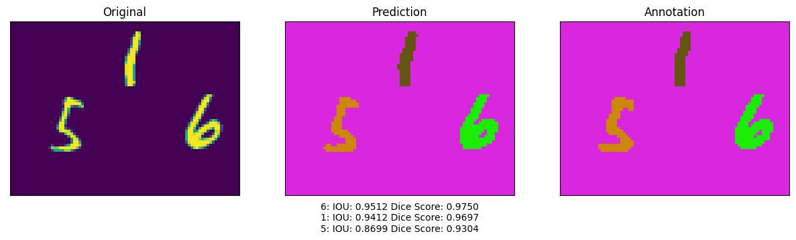

# M2NIST SEGMENTATION
This project is inspired by an assignment on this [course](https://www.coursera.org/learn/advanced-computer-vision-with-tensorflow).  
A UNET model is used to carry out segmentation on the [M2NIST](https://www.kaggle.com/datasets/farhanhubble/multimnistm2nist) dataset.

The model was trained on 80% of the data with 10% for both the validation and test sets.  
After training for only 5 epochs, an average iou of 83% was achieved on the test set.
